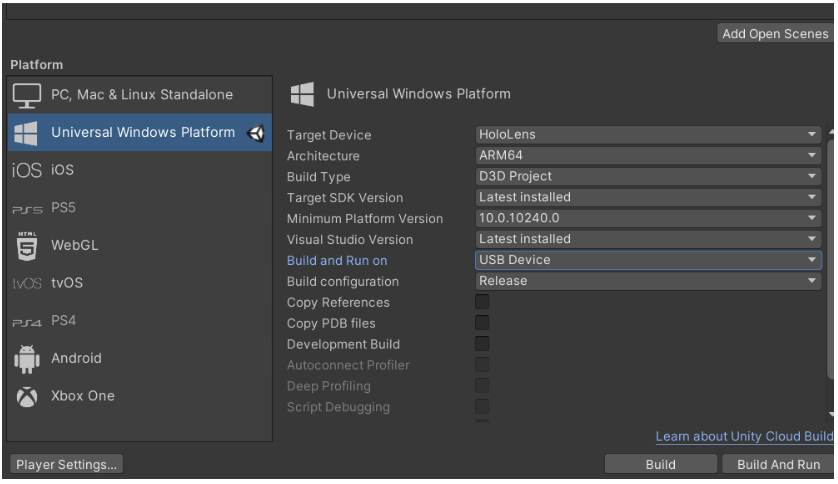
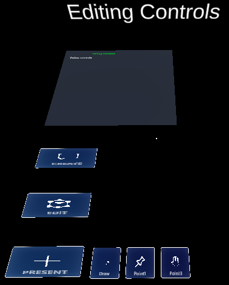

# Outline

* If you want to get started with Arduino
    * See the ArduinoSimpleSensors example (for basic connectivity)
* If you want to get started with multiple users
    * See the SimpleScene example (for basic connectivity)
    * See the MultiplayerBasicObjects example (for sharing custom objects)

# Instructions for all example scenes

* **Running in Single user with or without Arduino:**
  1. Open the example scene
  2. Set up Photon(you only need to do this once per Unity project)
      1. Get a new Photon app id from the Photon dashboard [https://dashboard.photonengine.com/](https://dashboard.photonengine.com/). 
      2. Enter this as the Photon App ID in the Photon “Highlight Network Settings” menu.
  3. Set up presence/absence of Arduino
      1. Find the ConfigurationProfile object
      2. If you will use Arduino:
    
			i. Enable the Arduino_Enabled checkbox, and set the Arduino_Com_Port to what your Arduino is connected to.
			
       	 ii. (Depending on the example scene, you will need the Arduino to function in a specific way, by updating it through the Arduino IDE).
      3. If you don’t have Arduino: 
      
         i. Disable the Arduino_Enabled checkbox.

  4. Run the project in the Unity editor
      
      1. Click Play in the editor. 
      2. In the GameView, use your mouse/keyboard to move around (read the [moving/interacting documentation](https://docs.google.com/document/d/11E8rnbJfgGQh4dxneZiqf222GhaeNIkoLftMDAjwl3g/edit#))
      3. In the Scene view you should see yourself as a player head moving around. 
      4. Click on the object menu or image menu to spawn new objects and move them around.
     
      
* **Running for Multiple users (after you followed instructions for Single user)**
  * The process for connecting on multiplayer is:
      * Start the PC Unity editor user (this is the master client)
      * Join any other users (on Hololens, on other PCs, on Mobile, etc)
      * Then start doing things together. 
      * NOTE: Users who join later may not be in sync with everyone else. So it’s important to wait for all users to join at the beginning before doing any activities.
  * **Important Notes**
      * **For multiple users, you will need one PC running the project in the Unity editor, and this needs to be started before all other users.**
      * **All users will need to use the same Photon ID**
      * **All users will need to have the same Scenes in the build settings, and the scene you want to run should be at the top (ideally the only one activated)**
  4. First, in the Unity build settings, make sure the current scene is added to the active scenes. Otherwise it will not be included in the build.
  5. To have the second user from a Hololens:
      1. In Unity, switch the build settings platform to UWP.
      2. If MRTK pops up about configuring the project, allow it to configure the project.
      3. Configure the UWP build settings for Hololens and make sure to add the current scene to the active scenes. Then build.
       
       
          1. More info [at this link](https://docs.microsoft.com/en-us/windows/mixed-reality/develop/unity/build-and-deploy-to-hololens)
          2. These are the build settings for HL2.
          3. <picture> </picture>
          

    4. You’ll then need to open the project under Visual Studio and finish building & deploying to the Hololens device ([more info here](https://docs.microsoft.com/en-us/windows/mixed-reality/develop/unity/build-and-deploy-to-hololens); build it for RELEASE, architecture ARM64, deploy over DEVICE USB or Remote Wifi)
6. To have a second user from a PC application:

    a. In Unity, switch the build settings platform to PC,Mac,Linux Standalone 
    b. Build the app as PC Standalone and wait until the build finishes.
    
7. In Unity press Play in the editor. This will make sure that your computer is running in the editor mode; it’s required to start first and run any time you do multiplayer. 
8. Now you can run the second user through the app you’ve just built.
9. You can have more users. Just remember that all of them need to be present when the application starts; otherwise if one person joins late they may not be in sync with everyone else.

# Arduino Multiplayer Objects Scene

   * **Summary**: 
        * This example shows **Multiplayer capabilities** (sharing objects and data between Hololenses and PC); **Arduino connection** (influencing the virtual world from the physical), and shows different **types of Object**s (static, interactive, and sensor-driven). 
        * Don’t have an Arduino or Hololenses ? No problem, it still works.
        * There are 4 areas in the scene (see images below):
            * **Example Channels** shows 3 data visualizations for channels C1, C2, C3 (blue charts); and a control panel for C2 (bottom left)
            * **Example Objects** shows different types objects: static (can’t be changed); networked (can be moved by different players); and networked sensor driven (are influenced by sensor channels)
            * **Editing Controls** are part of every project and contain a debug console, and buttons for switching what the user’s hands do (ie: create objects, edit objects, or draw/point)
            * **Crafting Menus** are part of every project and contain menus for creating 3D objects, 2D images, as well as a trash bin.

        * If you have an Arduino configured (see instructions below), the Arduino will send values on channel C2 and C3 to Unity, and receive channel C1 from Unity. The example Arduino sketch makes it send on channel C2 the value of a knob, and on channel C3 half the value it receives on channel C1.

        

<picture>
  
</picture>
 

<picture>
  

</picture>
 
 
 
<picture>
  
</picture>
&nbsp&nbsp&nbsp&nbsp&nbsp&nbsp&nbsp&nbsp&nbsp
<picture>
  
</picture>

   ### **How to run in Single user ----OUTDATED INSTRUCTIONS----:**
1. Set up and run the Arduino
    1. Open the Arduino IDE. 
    2. Connect an Arduino to the PC and upload the sketch found in **External_IDE_Projects\ArduinoProjects\ArduinoMultiplayerObjectsExample**.
    3. Make a note of what port the Arduino is connected to (you’ll need to put this in Unity)
    4. Open the SerialMonitor and check that the Arduino is sending serial data (you should see :C2:__ and :C3:__ values)
    5. Close the Serial Monitor.
    6. Keep the Arduino connected to the USB port.
2. Set up and run the project in the Unity editor
    1. Open the Unity project
   
    	* If you haven’t already, set up your PhotonID as detailed in the instructions for SimpleScene.
    2. Set up USB port
    
        * Search for the “**SerialController**” gameobject in the scene hierarchy. It might be disabled, that’s fine. 
	
        * Change its “Port Name” to whatever the Arduino is connected to (you can find this in the Arduino IDE. If you are on windows, this will be something like “COM7”. If you are on Mac, you’ll need to copy the whole path from the Arduino IDE, including “/dev/”…)
	
    3. Click Run in Unity
   
3. Play with it

    1. You should see all sensors changing except C3 and C4. 
    2. In the GameView, use your mouse/keyboard to move around (read the [moving/interacting documentation](./2.2_Intro_to_User_Interactions_and_Menus.md))
    3. Move around and find the ManualDataChannel window (this is set to control the C3 channel). Then click on the two bottom-right buttons which toggle the channel between low and high values; or use the slider to change its values. 
    4. Observe the C4 from the Arduino become half the value of C3. Also observe the Arduino turn its onboard LED when C4>500.
    5. **Known bugs**:
   
        * You will get a runtime error about object menu not being found; this is because this is a simple scene without object menu.
        * There is an issue when sending too much continuous data from Unity to Arduino, whereby the Arduino doesn’t receive data properly so Unity-generated sensor values may be lost or may be received as wrong values (super big or low). So your changes to C3 might not always register on the Arduino if you send too much at once. The connection from Arduino to Unity seems not affected by this.
        * Sometimes Unity hangs on start. Just restart.

    ### **How to run in Multi user:**
4. Follow the steps in the SimpleScene instructions to deploy the project on two clients.
5. Observe the same graphs on both the Standalone and the Unity window, and all graphs should be synchronized. You can change the values from either user and the Arduino should respond appropriately. 
6. You can now send this app to anyone else and they should be able to control your sensor values & Arduino. 

**Details about the code** - see the [Arduino documentation](./3.2_Arduino_Connection.md)

# A Simple Scene - Structure and First Execution

* **Summary**: The minimum you need for a scene are these objects (use this in all your scenes). You can create this cene by taking the Arduino multiplayer scene and removing all the extra objects. If you run a scene just containing this, you’ll see that multiple users can see each other, and create/modify objects together.
* <picture> </picture>

* **Details:**
    * **MRTK objects** (MixedReality Toolkit, Playspace, SceneContent)
    * **– CYBS – objects**
        * The **Base prefab** which is the core that makes everything work through Photon.
        * The **Channels and Devices prefab** which sets up the data channels and connections to external devices like USB, signal simulators, Websockets,                 Gogo boards.
        * The **World UIs prefab** which contains the menus for spawning multiplayer objects and for changing editing modes.
    * A directional light
    * A (disabled) Iulian’s Room 3d object; you can enable it so you feel part of a room. 

* **Next Steps**
    * see [Documentation](./) about multiplayer objects; about the code; about arduino; etc. 
