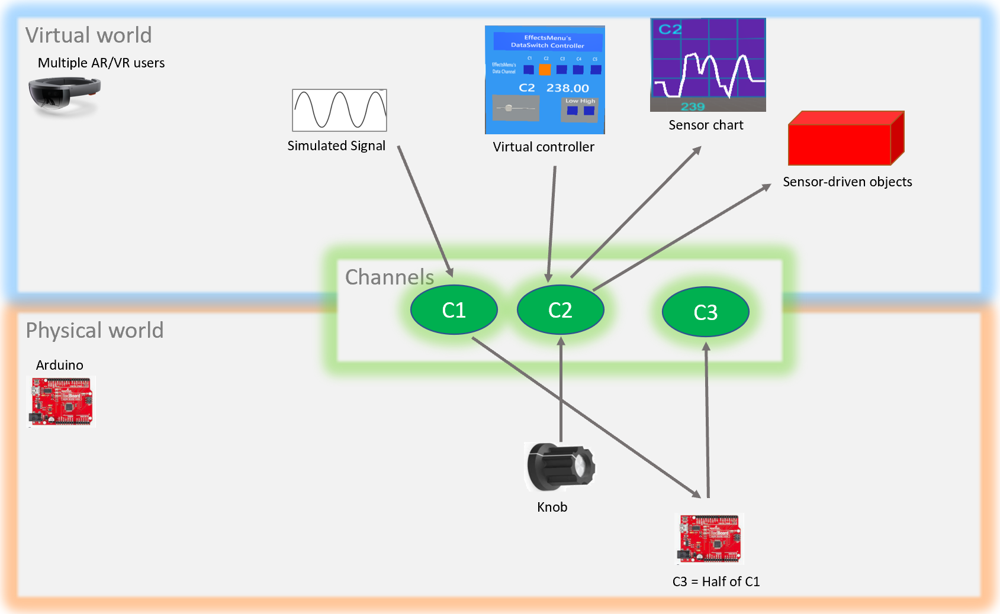
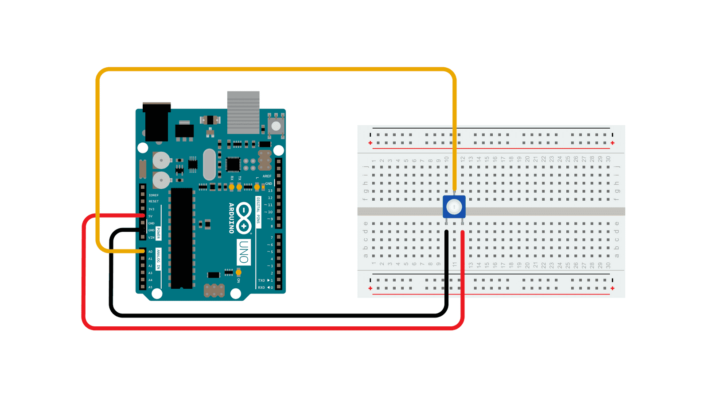
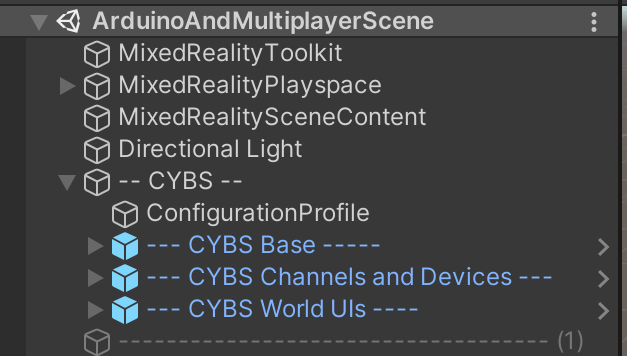

# Deployment Instructions For All Scenes

* **Running in Single user in the Unity Editor, with or without Arduino:**
  
  1. Open the example scene
  
  2. Set up Photon(you only need to do this once per Unity project)
     
     1. Get a new Photon app id from the Photon dashboard [https://dashboard.photonengine.com/](https://dashboard.photonengine.com/). 
     2. Enter this as the Photon App ID in the Photon “Highlight Network Settings” menu.
  
  3. Set up presence/absence of Arduino
     
     1. Find the **ConfigurationProfile** object
     
     2. If you don’t have Arduino:
        
           i. Disable the Arduino_Enabled checkbox.
     
     3. If you will use Arduino:
        
           i. Enable the Arduino_Enabled checkbox, and set the Arduino_Com_Port to what port your Arduino is connected to (you can get this from the Arduino IDE - for PC it looks like "COM5"; for Mac it looks like "/dev/tty...").
        
          ii. You'll also need to upload a sketch into the Arduino through the Arduino IDE. This will make the Arduino read/write from Unity; see the example description below to see what Arduino sketch you need for each example.
  
  4. Run the project in the Unity editor
     
     1. Click Play in the editor. 
     2. In the GameView, use your mouse/keyboard to move around (read the [moving/interacting documentation](https://docs.google.com/document/d/11E8rnbJfgGQh4dxneZiqf222GhaeNIkoLftMDAjwl3g/edit#))
     3. In the Scene view you should see yourself as a player head moving around. You can then do things like clicking on the object menu or image menu to spawn new objects and move them around.

* **Running for Multiple users (after you followed instructions for Single user)**
  
  * The process for connecting on multiplayer is:
    * Start the PC Unity editor user (this is the master client)
    * Join any other users (ex: on Hololens, on other PCs, on Mobile, etc)
    * Then start doing things together. 
    * NOTE:  It’s important to wait for all users to join at the beginning before doing any activities. Users who join later may not be in sync with everyone else.
  * **Important Notes**
    * **For multiple users, you will need one PC running the project in the Unity editor, and this needs to be started before all other users.**
    * **All users will need to use the same Photon ID**
    * **All users will need to have the same Scene as the top of the list in the build settings**
4. First, in the Unity build settings, make sure the current scene is added to the top of the active scenes. Otherwise it will not be included in the build.

5. If you want to have someone join **from a Hololens:**
   
   1. In Unity, switch the build settings platform to UWP.
   
   2. If MRTK pops up about configuring the project, allow it to configure the project.
   
   3. Configure the UWP build settings for Hololens and make sure to add the current scene to the active scenes. Then build.
      
      1. More info [at this link](https://docs.microsoft.com/en-us/windows/mixed-reality/develop/unity/build-and-deploy-to-hololens)
      
      2. These are the build settings for HL2.
      
      3. <picture> </picture>
      
      4. You’ll then need to open the project under Visual Studio and finish building & deploying to the Hololens device ([more info here](https://docs.microsoft.com/en-us/windows/mixed-reality/develop/unity/build-and-deploy-to-hololens); build it for RELEASE, architecture ARM64, deploy over DEVICE USB or Remote Wifi)

6. If you want to have someone join ** from a PC application**:
   
      a. In Unity, switch the build settings platform to PC,Mac,Linux Standalone 
      b. Build the app as PC Standalone and wait until the build finishes.

7. In Unity press Play in the editor. This will make sure that your computer is running in the editor mode; it’s required to start first and run any time you do multiplayer. 

8. Now you can run the second user through the app you’ve just built.

9. You can have more users. Just remember that all of them need to be present when the application starts; otherwise if one person joins late they may not be in sync with everyone else.

# Arduino Multiplayer Objects Scene

* **Summary**: 
  
  * This example shows **Multiplayer capabilities** (sharing objects and data between Hololenses and PC); **Arduino connection** (influencing the virtual world from the physical), and shows different **types of Object**s (static, interactive, and sensor-driven). 
  
  * Don’t have an Arduino or Hololenses ? No problem, it still works.
  
  * There are 4 areas in the scene (see images below):
    
    * **Example Channels** shows 3 data visualizations for channels C1, C2, C3 (blue charts); and a control panel for C2 (bottom left)
    * **Example Objects** shows different types objects: static (can’t be changed); networked (can be moved by different players); and networked sensor driven (are influenced by sensor channels)
    * **Editing Controls** are part of every project and contain a debug console, and buttons for switching what the user’s hands do (ie: create objects, edit objects, or draw/point)
    * **Crafting Menus** are part of every project and contain menus for creating 3D objects, 2D images, as well as a trash bin.
  
  * In Unity, some of the example objects will be pre-programmed to respond to data on channel C2 (ex: the color cube will change color).
  - If you don't have Arduino, you can change the value of C2 through the manual controller (the light-blue window under the C1 signal chart)
  * If you have an Arduino configured (see instructions below), the Arduino will receive channel C1 from Unity, and send values on channel C2 and C3 to Unity. The example Arduino sketch (to be deployed to the Arduino) makes it send on channel C2 the value of a knob, and on channel C3 half the value it receives on channel C1; the onboard Arduino LED also turns on if C1 is > 500.

<picture>
  
</picture>
 

<picture>
  

</picture>
 
 
 
<picture>
  
</picture>
&nbsp&nbsp&nbsp&nbsp&nbsp&nbsp&nbsp&nbsp&nbsp
<picture>
  
</picture>

^ simplified figure of how channel data is being used in this example.

### **Hardware Setup**

1. Create the circuit.
   
   * You will need an Arduino circuit that provides analog input on pin A0. 
   
   * 
   
   * You can find more details about this simple circuit, on this page: https://www.arduino.cc/en/Tutorial/BuiltInExamples/AnalogReadSerial

2. Upload the example sketch through the Arduino IDE.
   
   * The sketch for this example scene is **ArduinoMultiplayerObjectsExample** found in **External_IDE_Projects\ArduinoProjects**
   
   * This sketch takes the input from A0 and sends it on channel C2 to Unity. It also reads channel C1 from Unity and sends it back halved on channel C3; the onboard Arduino LED also turns on if C1 is > 500.

3. Check that the Arduino works properly
   
   * In the Arduino IDE, open the SerialMonitor and check that the Arduino is sending serial data (you should see :C2:__ and :C3:__ values), and C2 should change if you turn the knob.

4. Now you are ready to run this through Unity. Follow the instructions at the top of the document about running in single or multi player. Suggestion: First run this in the Unity Editor just to see if the Unity-Arduino connection works properly; then deploy to other devics.

**Known bugs**:

* You will get a runtime error about object menu not being found; this is because this is a simple scene without object menu.
* There is an issue when sending too much continuous data from Unity to Arduino, whereby the Arduino doesn’t receive data properly so Unity-generated sensor values may be lost or may be received as wrong values (super big or low). So your changes to C3 might not always register on the Arduino if you send too much at once. The connection from Arduino to Unity seems not affected by this.
* Sometimes Unity hangs on start. Just restart.

# A Simple Scene - Structure and First Execution

* **Summary**: The minimum you need for a scene are these objects (use this in all your scenes). You can create this cene by taking the Arduino multiplayer scene and removing all the extra objects. If you run a scene just containing this, you’ll see that multiple users can see each other, and create/modify objects together.

* 

* **Details:**
  
  * **MRTK objects** (MixedReality Toolkit, Playspace, SceneContent) needed for MRTK
  * A directional light to light up things properly
  * **–- CYBS –- Objects**
    * **ConfigurationProfile** sets up what devices & channels you will be using. Here you can configure whether you are sending channels to/from Arduino; have any simulated channels; etc
    * The **CYBS Base** prefab is the core that makes everything work through Photon.
    * The **CYBS Channels and Devices** prefab sets up the data channels and connections to external devices like USB, signal simulators, Websockets,                 Gogo boards, etc.
    * The **CYBS World UIs** prefab contains the menus for spawning multiplayer objects and for changing editing modes.
    
     

# **Next Steps**

* see [Documentation](./) about Multiplayer objects; about the Code; about Arduino; about Channels; etc.
