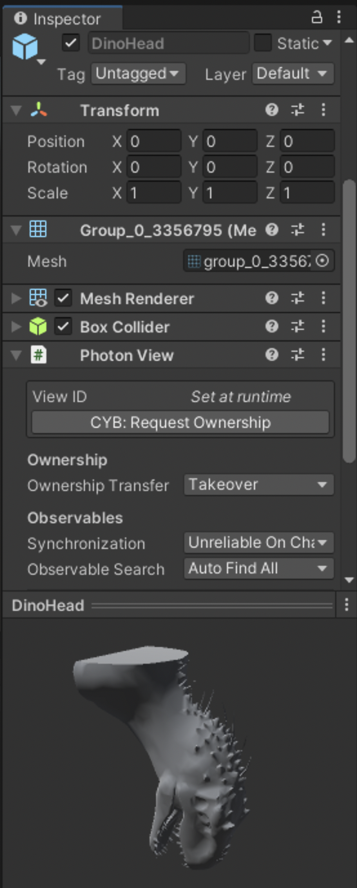
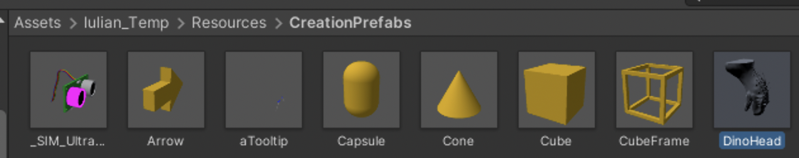
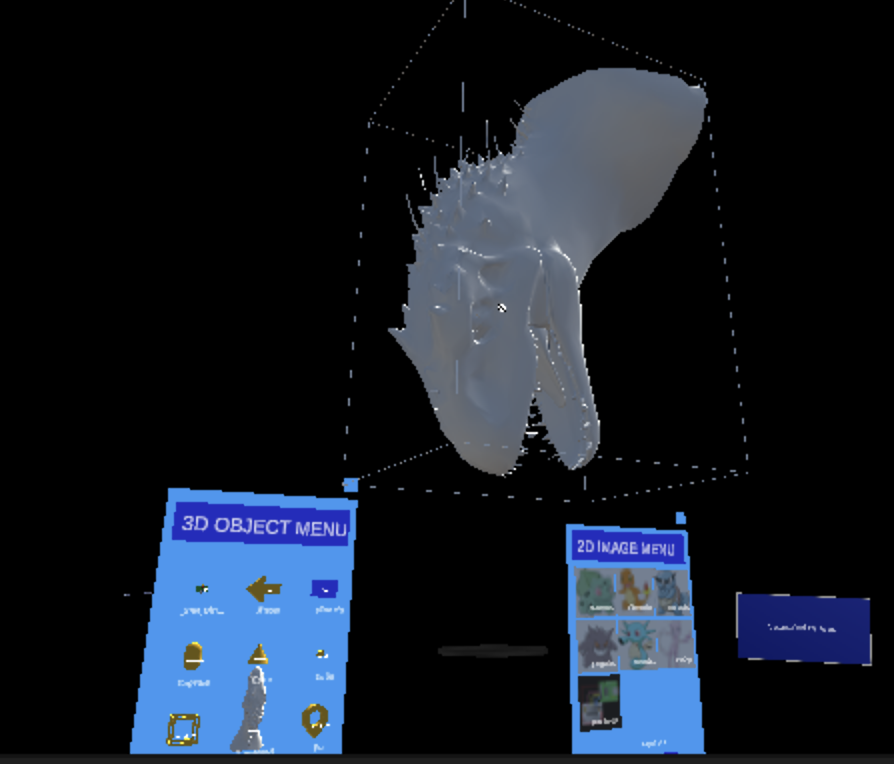
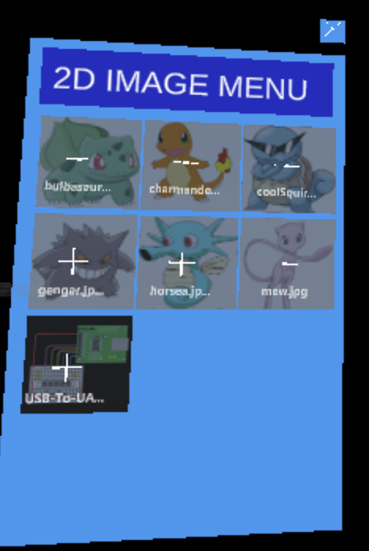
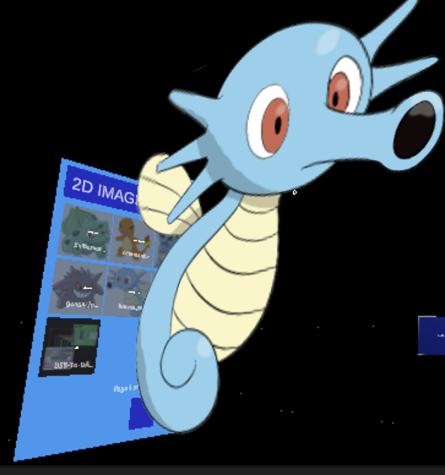
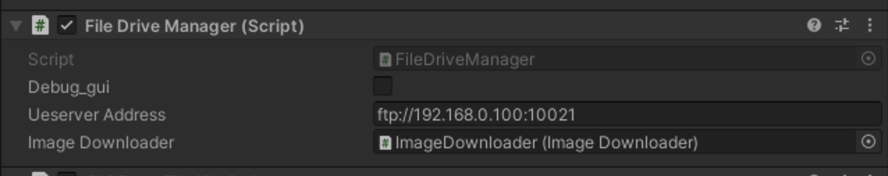
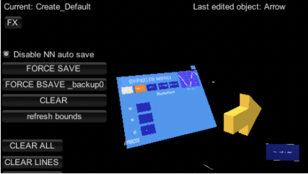

# 2.2. Intro to User Interactions and Menus

Table of Contents

[Moving Around and Interacting](./2.2_Intro_to_User_Interactions_and_Menus.md#moving-around-and-interacting) 
[3D Object Menu](./2.2_Intro_to_User_Interactions_and_Menus.md#3d-object-menu)
 [Image Menu](./2.2_Intro_to_User_Interactions_and_Menus.md#image-menu)
 [EffectsMenu](./2.2_Intro_to_User_Interactions_and_Menus.md#effectsmenu)

# Moving Around and Interacting

* In the Unity Editor 
	*  In the GameView, you can use your mouse/keyboard to move around using the MRTK keyboard services
	* Press W, A, S, D, Q, E keys to move the camera.
	* Hold the Right mouse button and move the mouse to look around.
	* To bring up the simulated hands, press Space bar(Right hand) or Left Shift key(Left hand)
	* To keep simulated hands in the view, press T or Y key
	* To rotate simulated hands, press and hold Ctrl key and move mouse
	* More info: [MRTK keyboard service ](https://docs.microsoft.com/en-us/windows/mixed-reality/mrtk-unity/mrtk2/features/input-simulation/input-simulation-service?view=mrtkunity-2022-05)
* In the Hololens
    * You can just move your head/body and pinch objects with your hands
    * To push buttons, you can either push your finger through them (slowly) or you can click from a distance by pointing with your hand and pinching
    * To draw (in draw mode), you can pinch with your finger and then move your hand
    * There is also support for interaction through a [handheld clicker](https://www.amazon.com/Bluetooth-Smartphones-zttopo-Wireless-Compatible/dp/B07MR1PHPZ/ref=sr_1_1_sspa?crid=3UVJL8NDRKSY7&keywords=clicker+camera&qid=1660163152&sprefix=clicker+camera%2Caps%2C79&sr=8-1-spons&psc=1) (which maps to holding down the Enter key)

# 3D Object Menu

	
The 3D object menu allows prefabs to be instantiated for all users currently using the application. <picture>
	
</picture>
	

  
### **Relevant code files:**

>CreationObjectManager.cs
     

### **Opening and closing the menu:**

The object menu is open by default for all users. To close/open, press “O” in the Unity Editor while the scene is running. 
	  
### **Creating an object from the menu**

The thumbnails of the menu are buttons which create 3d objects for the scene.

When you press each button, the object of that type will appear for you in a small circle to the side of the menu. 

    

<picture>
	
</picture><picture>&nbsp&nbsp&nbsp&nbsp&nbsp&nbsp&nbsp&nbsp&nbsp&nbsp&nbsp&nbsp&nbsp&nbsp&nbsp&nbsp&nbsp&nbsp&nbsp&nbsp&nbsp&nbsp&nbsp&nbsp&nbsp&nbsp&nbsp&nbsp&nbsp&nbsp&nbsp&nbsp&nbsp&nbsp&nbsp&nbsp&nbsp&nbsp&nbsp&nbsp&nbsp&nbsp&nbsp&nbsp&nbsp&nbsp&nbsp&nbsp&nbsp&nbsp&nbsp&nbsp&nbsp&nbsp&nbsp&nbsp&nbsp&nbsp&nbsp&nbsp&nbsp&nbsp&nbsp
	
</picture>

    Clicking on the thumbnail				The created object appears 

Now you can interact with this object in your AR scene: click and drag to move it around, resize it, add effects to it using the EffectsMenu, and more.

## **_How to add new objects to appear in the 3D Object Menu_**

Configure your new object as a prefab.

 -The prefab requires:

* Box Collider (which allows interaction with the object)

* Photon View (which updates the object over the network). Make sure the _Ownership Transfer_ parameter is set to _Takeover_.

<picture>
	
</picture>

Drag the prefab into the folder

>Assets/Iulian_Temp/Resources/CreationPrefabs

<picture>
	
</picture>

If the prefab is in that folder, the **CreationObjectManager.cs** script will load the prefab into the 3D Object Menu as a thumbnail when the scene starts.

<picture>
	
</picture> &nbsp &nbsp&nbsp&nbsp&nbsp&nbsp&nbsp&nbsp&nbsp&nbsp&nbsp&nbsp&nbsp<picture>
	
</picture>

	

						Sample prefab

										

		

_Clicking on our new object thumbnail creates our new object in the scene_

_Note: to get your new object to appear at scale in the menu and in the same loading dock circle as the other 3d objects, you need to tweak its local transform_

# Image Menu
<picture>
	
</picture>

The image menu allows images to be instantiated for all users in the application.

### **Relevant code files:**

>ThumbnailManager.cs
    

### **Opening and closing the menu:**

The menu is open by default for all users. To close/open, press “I” in the Unity Editor while the scene is running
	  

### **Creating an image from the menu**

Like the object menu, the thumbnails of this menu are buttons which create 2D images for the scene.

When you press each button, the image from that thumbnail will appear for you to the side of the menu. If you want an image with a transparent background, make sure to use a PNG with a transparent background.

    

<picture>
	
</picture><picture>&nbsp&nbsp&nbsp&nbsp&nbsp&nbsp&nbsp&nbsp&nbsp&nbsp&nbsp&nbsp&nbsp&nbsp&nbsp&nbsp&nbsp&nbsp&nbsp&nbsp&nbsp&nbsp&nbsp&nbsp&nbsp&nbsp&nbsp&nbsp&nbsp&nbsp&nbsp&nbsp&nbsp&nbsp&nbsp&nbsp&nbsp&nbsp&nbsp&nbsp&nbsp&nbsp&nbsp&nbsp&nbsp&nbsp&nbsp&nbsp&nbsp&nbsp&nbsp&nbsp&nbsp&nbsp&nbsp&nbsp&nbsp&nbsp&nbsp&nbsp&nbsp&nbsp&nbsp
	
</picture>

    Clicking on the thumbnail				The created image appears 		

## **_How to add new images to appear in the 2D Image Menu_**

>Add your images to the folder Assets/StreamingAssets/DriveSync

<picture>
	
</picture>

Currently supported file types: .jpg, .png, .gif, .tif, .tiff

Once in that folder, the script **FileDriveManager.cs** will load in assets from that local folder, as well as assets from a server address:

<picture>
	
</picture>

# EffectsMenu

The Effects Menu allows a data channel to influence the effects on an object. 

To show how to use the EffectsMenu in the scene to add a visual effect, we instantiate an object (an arrow) from the 3D Objects Menu, which places it in a circular destination object next to the menu. 

<picture>
  
</picture>

	 
<picture>
 
</picture> 
		
			Clicking the thumbnail&                        The instantiated arrow
	 

	 

	 
	 
	
 
Then we open the EffectsMenu (with the FX button in the top left corner of the UI), activate the XRotate button on the Rotation page, and adjust its strength to 0.5 with the associated slider:

<picture>
 
</picture>
<picture>
 
</picture>
<picture>
 
</picture>

	    The opened EffectsMenu		  Toggling the XRotate effect		Adjusting the slider value
	 
Now the arrow is twisting along its x-axis direction (the direction it is pointing), with its angle of rotation changing with the sine-wave data streaming through its attached dataSwitch.
