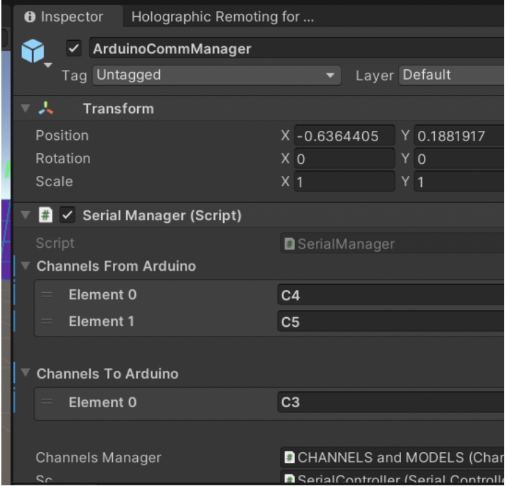

# 3.2. Arduino Connection

### **Description and configuration**

* To talk to Arduino, you’ll need a computer connected to Arduino using serial port. (*if you want to talk through wifi, you could use websockets)
* In a multiplayer session, only the user running in the Unity Editor is actually talking to the Arduino; everyone else gets/sends data through the [data channels](./3.1_Data_and_Channels_.md)
* Configuring the serial port:
    * The computer’s serial port is configured through the “**SerialController**” object.
    * When plugging a new arduino you will need to update the Port Name in the “SerialController” object, to match what is in the Arduino IDE (on Mac this includes /dev/..)
* Configuring the data channels:
    * Search for the “**SerialPort**” gameobject in the scene hierarchy. 
        * If it’s disabled, you need to enable it otherwise you won’t get data to/from the Arduino.
    * Search for the “**ArduinoCommManager**” object. It is in charge of talking to the arduino through the serial port. It keeps track of which channels will be sent/received with the Arduino. 
        * If you want other channels, you need to update the lists To Unity and From Unity:

        

<picture>
  
</picture>

### **Messages between Arduino and Unity:**

* Messages to/from Arduino are always sent through the com port in the form of “:X:V” where X is channel id (ex: C1) and V is a value from 0-1024. (ex: “:C4:123”)
* The provided Arduino code makes it easy to send/receive data with Unity, but if you want to do it manually you can use simple serial communication
* Sending from Arduino to Unity: 
    * In the Arduino code, using Serial.println(“:C4:555”) will tell Unity that the C4 channel’s value should be 555. 
    * On reception of a new value from Arduino, the channel’s AtomicDataModel will be updated (assuming the channel is listed in the ArduinoCommManager).
* Sending: 
    * From Unity, you can use SerialController to send “:C3:222”, and the Arduino will receive this value. 
    * In the Unity project, when a channel’s ADM model is updated, it is automatically sent to Arduino (assuming the channel is listed in the ArduinoCommManager).
    * Known bugs: there are issues when Unity tries to send too much data; see section below.

**Known issues**

* When sending too much continuous data from Unity to Arduino, the data may be lost or may be received as wrong values (ex: super big or low numbers). If this happens, reduce the amount of channels / data that you send from Unity to Arduino. The connection from Arduino to Unity doesn’t seem to be affected.

