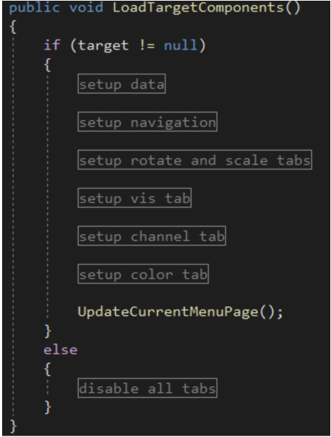
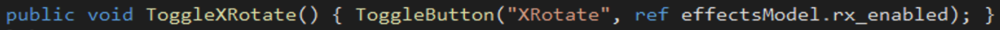
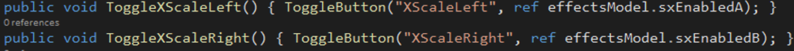
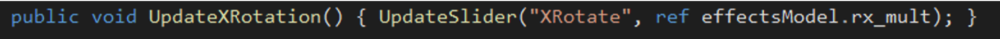
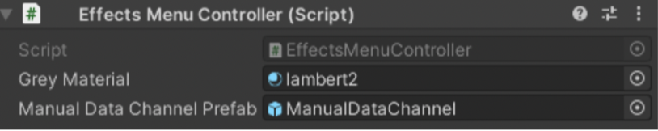
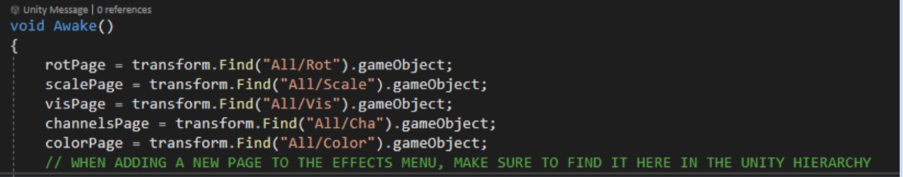

# 3.3. Effects Menu and Visual Effects

## **_LIT Lab - Visual Effects Documentation, Spring 2022_**

This documentation is meant for programmers hoping to use and extend our AR visual effects library.

Color code:

* File name:  blue or **bold** 
* Method names: green or <ins>**underlined**</ins> 
* Variable names: yellow or _**italics**_

In our Unity scene, the user can manipulate objects with basic visual effects using the EffectsMenu. It currently supports **rotation** (having an object twist in place), **scaling** (having an object stretch in size), **visibility** toggling (making it appear and disappear), and changing **color**. Further customizable visual effects can be added with what we call “plugins”, more complex effects not controlled directly by the EffectsMenu but using some of the same underlying code. 

### **_Overview of relevant files_**

####   **EffectsMenuController.cs**

 * This is the script that manages the behavior of the effects menu, including all of its buttons, sliders, visual displays, menu navigation, and data source.

 ####   **EffectsMenu.cs**

* This script listens while the scene is running for the most recent object the user has clicked on. Once the user clicks on an object, this script passes the object’s transform to the <ins>**SetTarget**</ins>  method in **EffectsMenuController.cs**, which refreshes the menu.

 ####   **ManualDataChannelController.cs**

 * This script allows the user to directly control, with a button and a slider, the visual effect of an object. For example, instead of letting an external data source control a visual effect like scale, the user can directly drag the slider on the ManualDataChannel from left to right to scale up an object’s size from small to large.

   **EP\_\<PluginName>_Manager.cs**, **EP\_&lt;PluginName>_Model.cs**, and **EP\_&lt;PluginName>_Menu.cs** 

  * These files control the behavior of each visual effect plugin (more complex than rotation, scaling, and visibility toggling). For example  **EP\_Path_Manager.cs** controls how the data source moves an object along points in a path, and  **EP\_RandomScale_Manager.cs** controls how an object’s size scales with a random perturbation applied to its data source. Each plugin must also have a file  **EP\_&lt;PluginName>_Model.cs**, which defines all the parameters needed for the effect and updates them over the network. In addition, each plugin must have a file  **EP\_&lt;PluginName>_Menu.cs**, which controls the visual GUI the user interacts with to control the plugin.
  
## _How does the EffectsMenu control the behavior of objects?_

To show how to use the EffectsMenu in the scene to add a visual effect, we instantiate an object (an arrow) from the 3D Objects Menu, which places it in a circular destination object next to the menu. 

<picture>
  
</picture> &nbsp &nbsp &nbsp &nbsp &nbsp &nbsp &nbsp

	
<picture>
 
</picture> 
	
	 

	    Clicking the thumbnail                     The instantiated arrow         
	 

	 
	 
	
 
Then we open the EffectsMenu (with the FX button in the top left corner of the UI), activate the XRotate button on the Rotation page, and adjust its strength to 0.5 with the associated slider:

<picture>
 
</picture>
<picture>
 
</picture>
<picture>
 
</picture>

	    The opened EffectsMenu		  Toggling the XRotate effect		Adjusting the slider value
	 
Now the arrow is twisting along its x-axis direction (the direction it is pointing), with its angle of rotation changing with the sine-wave data streaming through its attached dataSwitch.    

In **EffectsMenuController.cs**, we maintain a reference to the target object’s transform called ***target***. Each target object has one or more data switches, which control the target object’s rotation, scaled resizing, visibility (toggled on or off), and color (available only for drawings).   

Each data switch controls those parameters (rotation, scaled resizing, and visibility toggling on/off) based on a particular data channel. A data channel maintains a value between 0 and 1024 which changes over time. The user can switch this channel on the effects menu Channels tab to control which channel should control the visual effects; in addition, the user can click the sensor chart to bring up the ManualDataChannels popup menu and control the flow of data directly.

## **_Important methods in the file EffectsMenuController.cs_**

### The ** <ins>LoadTargetComponents</ins>** method

This method refreshes the EffectsMenu when the user selects a new target object by clicking on it with the laser-pointer, or by clicking on it with the 3D hand.

The method is currently organized into different regions. Each region in the code here (setup data, setup navigation, etc) refreshes components of the EffectsMenu based on the target object and its attached data. 

Once this method is run, any interaction with buttons and sliders on the EffectsMenu will change the parameters of the effects controlling the target object.

<picture>
 
</picture>

This region shows how for a simple tab like Rotate and Scale that just has buttons and sliders, we can just call the method <ins>**LoadModelEffectValue**</ins> with inputs for the name of each effect and references to its associated parameters from the ***effectsModel***:

	 
<picture>
 
</picture>

Or for an example of a more uniquely customized tab, like the channels tab, we load the tab parameters a different way without the reusable <ins>**LoadModelEffectValue**</ins> function

<picture>
 
</picture>

### **Toggle functions for buttons**

These functions control the EffectsMenu buttons, which activate or deactivate ***effectsModel*** parameters.

For example, we add the XRotate button by calling the <ins>**ToggleButton**</ins> method with two inputs: 

<picture>
 
</picture>

1. the name of the effect, in this case “XRotate”
2. a reference to that effect in the ***effectsModel*** using the ref keyword, in this case ref ***effectsModel.rx_enabled***

Then in Unity, we assign <ins>**ToggleXRotate**</ins> to the button that will turn the XRotate effect on and off.

**Two buttons for one effect:** For XScale, which is an effect with two separate buttons (toggled scaling in both the left and right directions along the x-axis, which are two different values ***effectsModel.sxEnabledA*** and ***effectsModel.sxEnabledB***), we create two methods to call the ***ToggleButton*** method for each scaling direction:

<picture>
 
</picture>

    
### **Update functions for sliders**

These functions control the EffectsMenu sliders, which update the ***effectsModel*** values .

For example, we add the XRotate slider by calling the <ins>**UpdateSlider**</ins> method with two inputs: 

<picture>
 
</picture>

1. the name of the effect, in this case “XRotate”
2. a reference to that effect in the ***effectsModel*** using the ref keyword, in this case ref ***effectsModel.rx_mult***

Then in Unity, we assign <ins>**UpdateXRotation**</ins> to the slider that will change the amount of x-axis rotation.

## **_Important variables in EffectsMenuController.cs_**

Public variables (to be loaded in the inspector)

<picture>
 
</picture>

Make sure the Manual data channel prefab is loaded in the inspector

* ***manualDataChannelPrefab***
    * The prefab of the manualDataChannels menu that allows the user to directly adjust the dataSwitch channel and values

Important pieces

* ***target***
    * The transform of the target object, which is updated live during runtime based on which object in the scene the user most recently touched / clicked on.
    * We assume this target has at least one data switch attached to it.
    * When a new target object is assigned, the function <ins>**LoadTargetComponents**</ins> is called, which refreshes the menu.
* ***effectsModel***
    * This is the effectsModel attached to a target object. This model has boolean parameters representing whether each effect is enabled, as well as float parameters representing the current value of each effect. This model’s parameters are updated whenever the user toggles effects on/off with buttons or updates the values of the effects with sliders.
* ***dataSwitches***
    * These are the dataSwitches attached to a target object. Each target object has at least one dataSwitch, the first of which is the data switch which controls the basic effects (rotation, scaling, visibility toggling, and color). Any additional dataSwitches are assumed to apply to additional plugins activated on the target object.
* ***ModelEffectsToLoad***
    * This is an array of strings representing the names of the effects available in the menu. The current values are “XRotate”, “YRotate”, “ZRotate”, “XScaleLeft”, “XScaleRight”, “YScaleUp”, “YScaleDown”, “ZScaleLeft”, “ZScaleRight”, “Vis”, and “AboveOrBelow”
    * **When adding new effects to the EffectsMenu, make sure to update this list!**
* Buttons and sliders
    * ***backplateNormals*** and ***backplateToggles*** store the off and on buttons for each effect
    * ***sliderObjects***, ***sliderLabels***, and ***Sliders*** store the sliders for each effect (as well as labels for the current values of the sliders)
* Navigation
    * **When adding new pages to the EffectsMenu, make sure to update these lists!**
    * ***pages***
        * The array of gameObjects for each page on the effects menu. The current values are rotPage, scalePage, visPage, colorPage, channelsPage.
    * ***allTabObjectNames***
        * A string array with the names of the tabs in the EffectsMenu. The current values are “Color”, “Rot”, “Scale”, “Vis”, and “Cha”

## **_How to add new effects and/or pages to the effects menu _**

* Define how the effect/page is updated in the method <ins>**LoadTargetComponents**</ins> in **EffectsMenuController.cs**
    * Determine how your effect is changed by the user. For example, is the effect changed with one button (like activating x-rotate) or two (like activating x-scaling either to the **left** or the **right**)? The answer to this question will determine which instance of the function <ins>**LoadModelEffectValue**</ins> you will add to the function ***LoadTargetComponents***
* If adding a new page to the menu,
    * Add your page to the string array ***allTabObjectNames*** and create a gameobject for it (e.g. ***rotPage, scalePage***)
    * Make sure the gameObjects in the Unity hierarchy are named in the following way (follow the existing page, e.g. Rotation, as a guide)  <picture>
 
</picture> 

    * Tabname
        * Labels
            * Val&lt;EffectName1>
            * Val&lt;EffectName2>
            * …
        * Buttons
            * Toggle&lt;EffectName1>
            * Toggle&lt;EffectName2>
            * …
        * Inputs
            * Val&lt;EffectName1>
                * Slider
            * Val&lt;EffectName2>
                * Slider
            * …
    * These naming conventions ensure the page is compatible with <ins>**LoadModelEffectValueDicts**</ins> - that the names of objects in the hierarchy follow these patterns for its buttons, sliders, and labels.

	 
* For a new effect, update the list ***ModelEffectsToLoad*** in **EffectsMenuController.cs**
* For a new page, update ***pages*** and **a*llTabObjectNames*** in **EffectsMenuController.cs**,  and remember to find the objects from the Unity hierarchy in the Awake function along with the other pages:

	
<picture>
 
</picture>

* Lastly, define any necessary button and slider methods in **EffectsMenuController.cs** to connect with the buttons and sliders in the UI
