# 3.4. Effects Plugins Overview and Tutorial

## Plugin System Overview and Tutorial

In our library, a plugin controls the visual transformations applied to an object beyond the base transformations available directly on the EffectsMenu itself. If you are not familiar with the Effects Menu please read the [documentation](./3.3_Effects_Menu_and_Visual_Effects_.md). 

Some plugins are applied **before** normal effects (e.g. the Delay effect, which allows multiple objects to respond to the same signal after delays of different lengths)

Some plugins are applied **after** normal effects (e.g. the path plugin, which moves an object along a path.)

<picture>
  
</picture>

A completed plugin must implement the required functions in these abstract classes:

*  EP\_&lt;PluginName>_Manager.cs, which inherits from the abstract class AEffect4PluginManager.cs
    * This is the main class to control plugin behavior. The important function that drives the main behavior is <ins>RespondToNewValue</ins>, which specifies how the target object’s position, rotation and scale should change based on the incoming sensor values from a data channel.
* EP\_&lt;PluginName>_Model.cs, which inherits from the abstract class AEffect4PluginModel.cs
    * This class needs the user to specify all the parameters the plugin requires, and implement the function <ins>DoPhotonSerialize</ins> to update them over the Photon network.
* EP\_&lt;PluginName>_Menu.cs, which inherits from the abstract class AEffect4PluginMenu.cs, is optional. So far none of our plugins have implemented a menu GUI, this abstract class is a stand-in for what may be future GUI implementations of plugins. 

As a tutorial, we walk through the important parts of the code and Unity setup for plugins. With this tutorial, you will make  The RandomScale Plugin! 
<picture>
  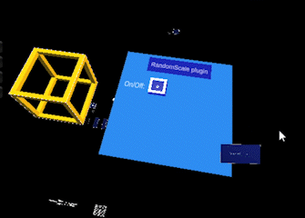
</picture>

## 1. Setting up the EP\_&lt;PluginName>_Manager.cs script

We have defined EP\_RandomScale_Manager.cs, EP\_RandomScale_Model.cs, and EP\_RandomScale_Menu.cs, which inherit from each of the above abstract classes respectively. 

EP\_RandomScale_Manager.cs must implement the <ins>GetPluginName</ins> function (simply returning a string with the name of the plugin) and the <ins>RespondToNewValue</ins> function by specifying what the object’s new position, rotation, and scale are, based on the incoming sensor value and the previous position & rotation. 

In the <ins>RespondToNewValue</ins> function for RandomScale we will change the scale and leave the position and rotation unchanged. Thirdly, this script must implement the function <ins>ToggleMenuGui</ins>, discussed in section 4 below.

<picture>
  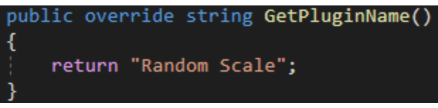
</picture>
 
<picture>
  
</picture>  

## 2. Setting up the EP\_&lt;PluginName>_Model.cs script

EP\_RandomScale_Model.cs is a simpler script to implement, since we just specify any parameters used in EP\_RandomScale_Manager.cs and specify the order in which they are updated over the Photon network in the DoPhotonSerialize function. Note that we are not really doing much in the <ins>DoPhotonSerialize</ins> function, we are only sending the parameters into the stream if ***isWriting*** is true, and reading the parameters from the stream if ***isWriting*** is false. 

<picture>
  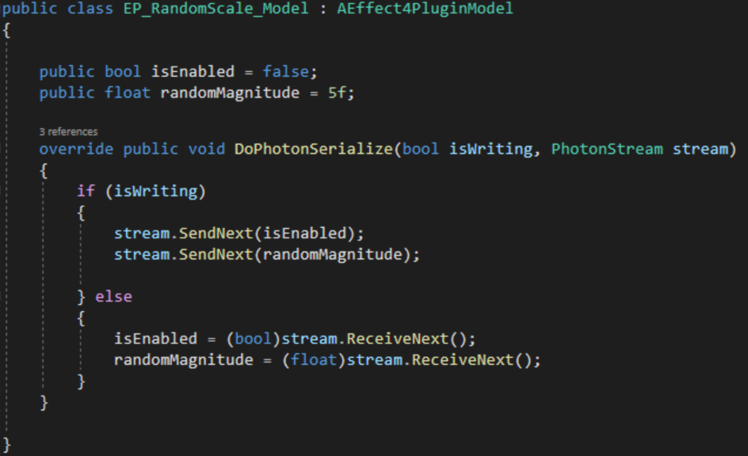
</picture>  

## 3. Setting up the EP\_&lt;PluginName>_Menu.cs script

**Rendering the menu in EP\_&lt;PluginName>_Menu.cs**

<picture>
  
</picture>

Here we define the functions <ins>Activate, OpenMenu, and HideMenu</ins> for opening and closing the GUI, as well as defining parameters  ***menuScale*** and ***menuShift*** for its position in relation to the gameobject. The scale and shift parameters should be configured in the inspector based on the size of the GUI you design.

The Activate, OpenMenu, and HideMenu functions are called from the manager script, described below in section 4.    

**Referencing the MRTK components fromEP\_&lt;PluginName>_Menu.cs**

<picture>
  
</picture>Here we declare references to the GameObjects and components of our MRTK elements, and grab the references for the two different button states in the <ins>Start</ins> function: 

 
<picture>
  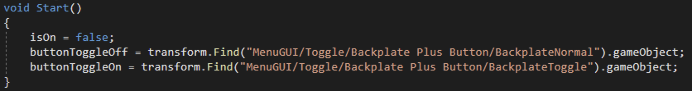
</picture>

 
 

**Changing the state of the MRTK components from EP\_&lt;PluginName>_Menu.cs**

<picture>
  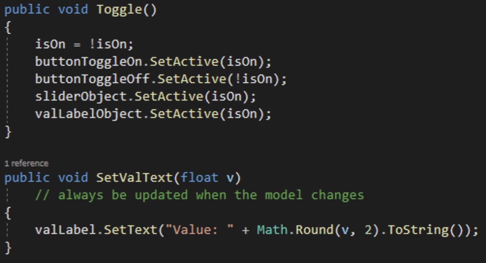
</picture>The last step to complete the RandomScale menu script is to implement the visual behavior of the On/Off button with the <ins>Toggle</ins> function, which turns the menu GameObjects on & off, and the visual behavior of the slider label with the <ins>SetValText</ins> function. These functions are called from the manager script, described below in section 4.
      

## 4. Responding to menu interaction in EP\_&lt;PluginName>_Manager.cs

**Configuring the manager script so that the MenuGUI can be launched from the EffectsMenu Plugins page**
<picture>
  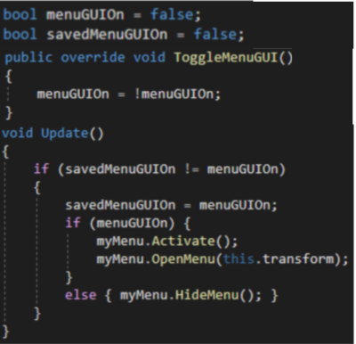
</picture>

The parameters ***menuGUIOn*** and ***savedMenuGUIOn*** are included at the beginning of the manager script to facilitate the menu appearing and disappearing in response to a Launch button on the Plugins page of the EffectsMenu for each plugin (each of which calls the function <ins>ToggleMenuGUI</ins> to change the state of ***menuGUIOn***)

Then, in the Update function, this code responds to the current state of the ***menuGUIOn*** boolean variable to call the <ins>Activate & OpenMenu</ins>  functions when ***menuGUIOn*** is set to true, and to call the <ins>HideMenu</ins> function when ***menuGUIOn*** is set to false.
      
**Configuring the manager script to update the effects model and GUI visuals in response to user interaction**

<picture>
  
</picture>The final components of the menu system for the RandomScale plugin are these two functions in the manager script which respond to the user clicking the On/Off button and moving the slider on the GUI. Note that these functions change the parameters of ***myModel*** and update the visuals of the GUI using the functions defined above in ***myMenu***.
      

## 5. Setting up the &lt;Plugin prefab>

Once the scripts are finished, we add the plugin to the scene by creating a prefab for the plugin.

We name the parent object EffectPlugin_RandomScale, and attach the scripts EP\_RandomScale_Manager.cs and EP\_RandomScale_Menu.cs. 
	
<picture>
  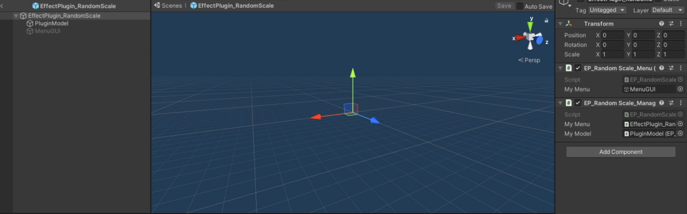
</picture>	

We create two child objects, the first one named PluginModel and attach the script EP\_RandomScale_Model.cs. When the scene is running, we can check the ***isEnabled*** box to turn the plugin on and off (as well as change other settings in the inspector). 

The second child object we name MenuGUI and include it as a parameter in EP\_RandomScale_Menu vis the inspector (see above image). We omit the specific construction of the MenuGUI in this tutorial, since each GUI will be unique based on the needs of the plugin.
	
<picture>
  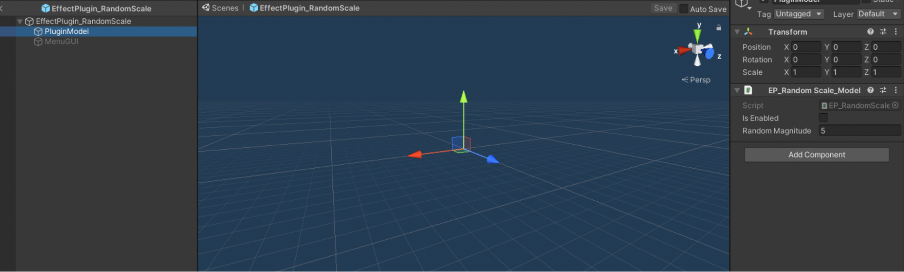
</picture>	

Finally, to have the plugin available during runtime, we include EffectPlugin_RandomScale.prefab in the BasePrefabContainer prefab 

`(location: Assets/Iulian_Temp/Resources/InternalPrefabs/BasePrefabContainer.prefab)`

To do this, we open the BasePrefabContainer and drag our EffectPlugin_RandomScale.prefab into the ***PluginsToInstantiate_runAfter*** list in the Effect4Gen script in the inspector.

<picture>
  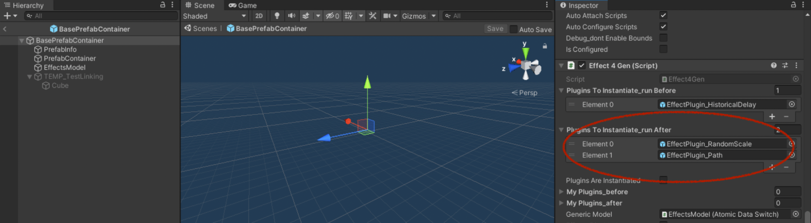
</picture>	

	
## 6.  Instantiate a plugin-equipped object into the scene

Following this tutorial, any objects that are created from the 3D Object Menu during runtime will now be instantiated with the RandomScale Plugin prefab attached:

<picture>
  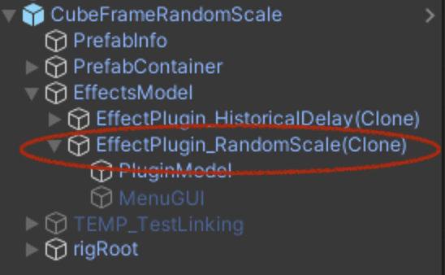
</picture>

## 7)Things to keep in mind for more complex plugins

Some plugins are applied **before** normal effects (e.g. the Delay effect, which allows multiple objects to respond to the same signal after delays of different lengths)

Some plugins are applied **after** normal effects (e.g. the path plugin, which moves an object along a path.)

<picture>
  
	</picture>

For a more complex plugin like the Path plugin we need to send data structures like vectors and lists into the Photon stream. The photon network can’t stream lists or vectors so we just make sure to send the float values one at a time.
	
<picture>
  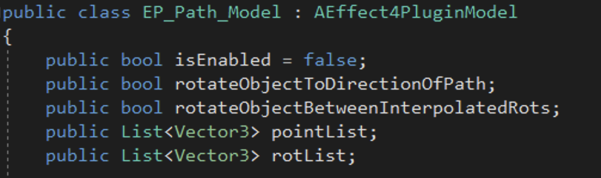
</picture>
 
<picture>
  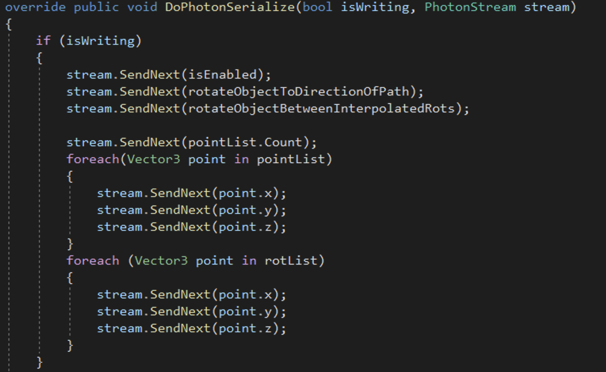
</picture>

	The order in which we send variables into the photon stream…
<picture>
  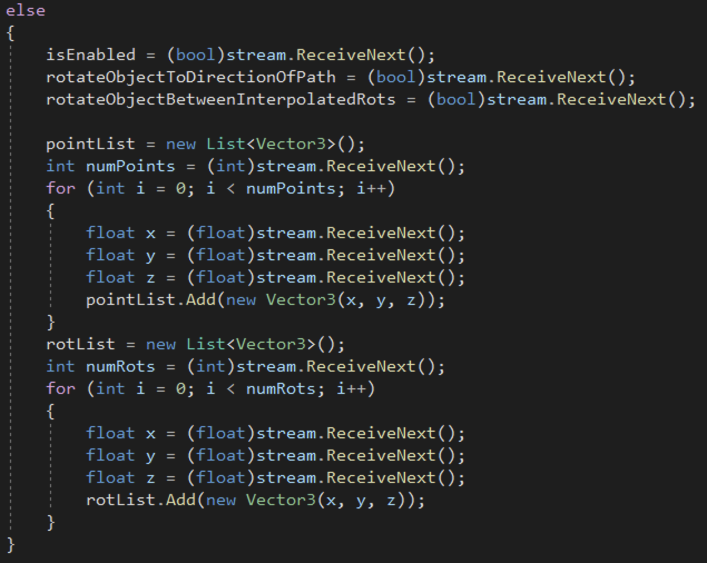
</picture>

	must match the order in which we receive variables from the photon stream.

## Sample Scenes

### **EffectsMenuScene**

<picture>
  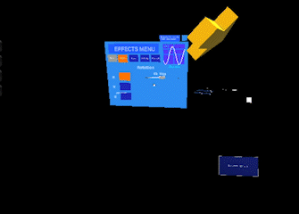
</picture>

We have one arrow object (named ArrowTwist) configured to rotate in the X and Y directions. This is done by using the EffectsMenu to control the object’s XRotate and YRotate effects with the channel C3, whose data stream rises and falls according to values from the function y=sin(x). 

### **Opening the EffectsMenu:**

<picture>
  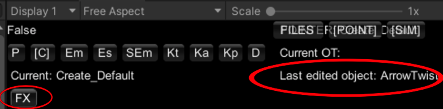
</picture>

The scene is configured for the ArrowTwist object to begin with the rotation already activated. To open the EffectsMenu to change the rotation settings, you need to 

1. Click on the arrow object in the scene so that ArrowTwist appears as the “Last edited object” in the text menu on the screen
2. Click the small button that says “FX” in the lower left corner of the text menu. Now the EffectsMenu should appear.

### **Adjusting the Rotation effects:**

The three buttons to the left of the Rotation panel each turn the rotation on/off - the first button in the X direction, the second in the Y direction, and the third in the Z direction.

By hovering the pointer over a button and clicking, the button will toggle (change) between Blue (in the off state) and Orange (in the On state).

Once in the On state, a slider will appear, where you can adjust the strength of the rotation in each direction. In the gif above, for example, the arrow starts with XRotation on, and then later we have both XRotation and YRotation on.

<picture>
  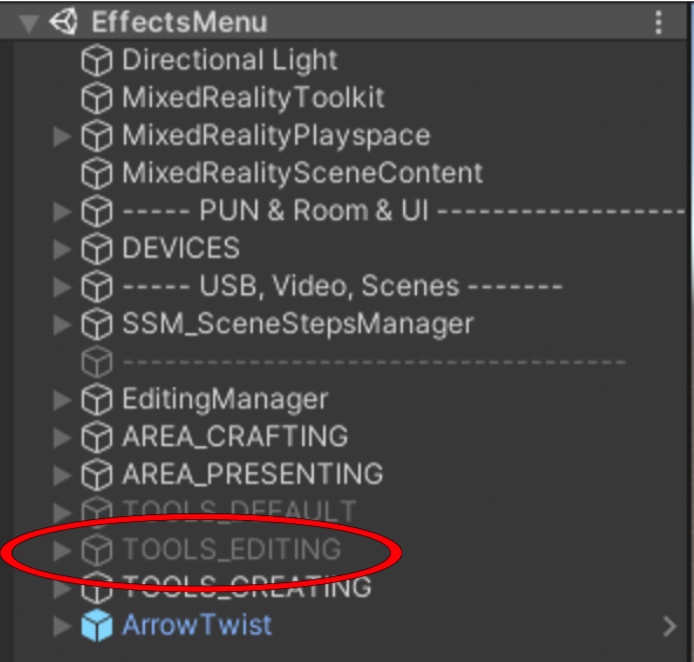
</picture> &nbsp&nbsp&nbsp&nbsp&nbsp&nbsp&nbsp&nbsp&nbsp&nbsp&nbsp&nbsp&nbsp&nbsp&nbsp&nbsp&nbsp&nbsp&nbsp&nbsp&nbsp&nbsp&nbsp&nbsp&nbsp&nbsp&nbsp&nbsp&nbsp&nbsp&nbsp&nbsp&nbsp&nbsp&nbsp&nbsp&nbsp&nbsp&nbsp&nbsp&nbsp&nbsp&nbsp&nbsp&nbsp&nbsp&nbsp&nbsp&nbsp&nbsp&nbsp&nbsp&nbsp&nbsp&nbsp&nbsp&nbsp&nbsp&nbsp&nbsp&nbsp&nbsp&nbsp&nbsp&nbsp&nbsp&nbsp&nbsp&nbsp&nbsp&nbsp&nbsp&nbsp&nbsp&nbsp&nbsp&nbsp&nbsp
	<picture>
	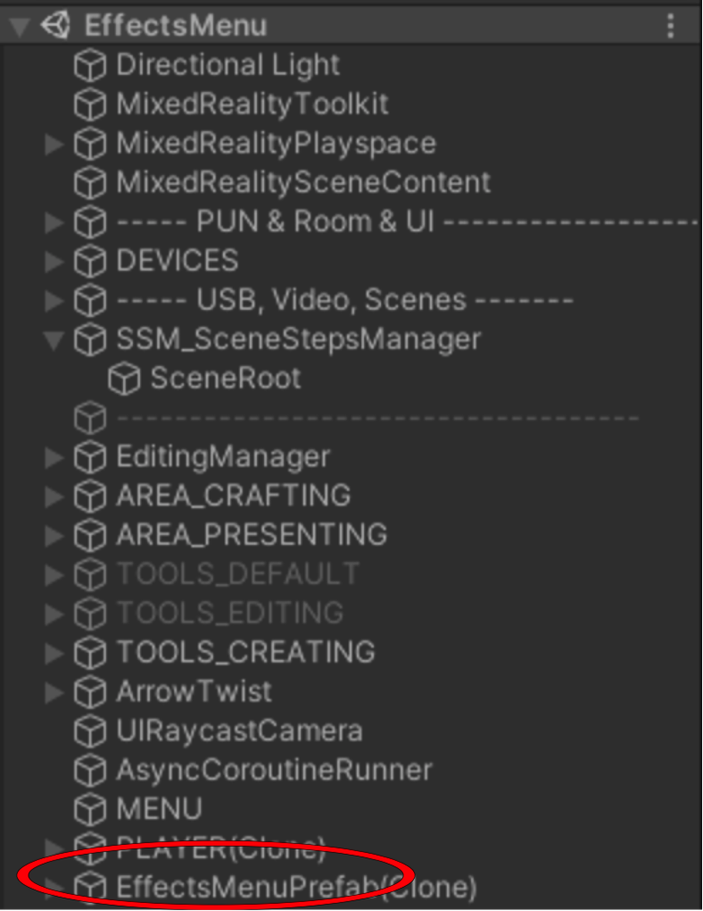
	
</picture>

	ArrowTwist  within the scene hierarchy 		              The EffectsMenu prefab within the scene hierarchy only appears after clicking “FX”

### **ManualDataChannelScene**

We have one CubeFrame object (named CubeFrameGrow) configured to change its x, y, and z-scales. 

<picture>
	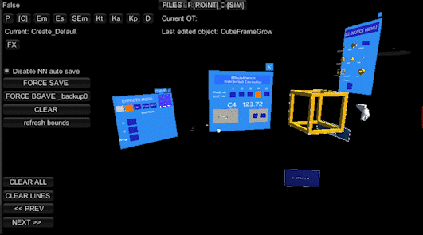
	
</picture>

	Changing the size of an object using the slider on the ManualDataChannel

Open the effects menu, and use the AR hand (hold spacebar) to click on the effects menu sensor chart (move the AR hand against the surface of the chart to launch):

<picture>
	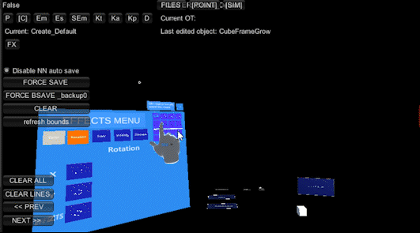
	
</picture>

	Clicking the sensor chart to launch the ManualDataChannel      	           

This opens up the ManualDataChannel, which is configured to control the size of the cube. This is done by toggling on all the XScale, YScale, and ZScale effects on the Scale tab of the EffectsMenu, and the channel “C4” activated on **both** the EffectsMenu **and** the ManualDataChannel. 

**Using the ManualDataChannel slider, change the size of the cube directly!**

<picture>
  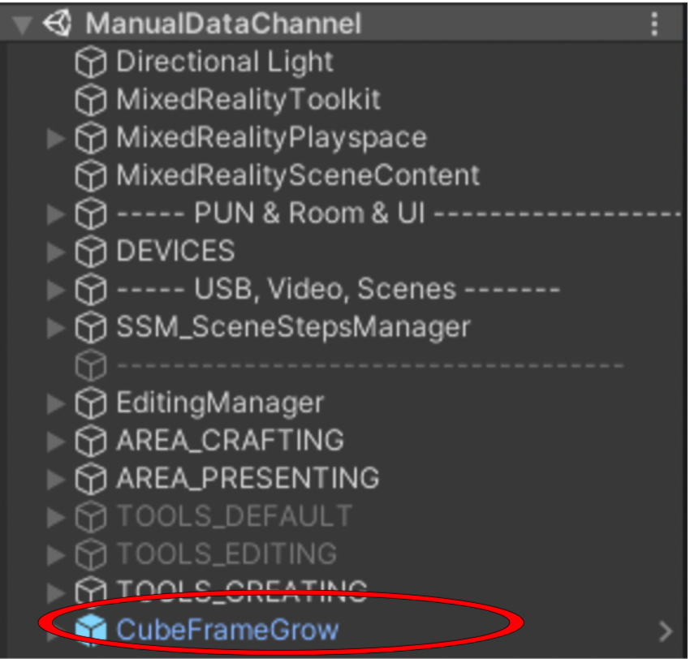
</picture> &nbsp&nbsp&nbsp&nbsp&nbsp&nbsp&nbsp&nbsp&nbsp&nbsp&nbsp&nbsp&nbsp&nbsp&nbsp&nbsp&nbsp&nbsp&nbsp&nbsp&nbsp&nbsp&nbsp&nbsp&nbsp&nbsp&nbsp&nbsp&nbsp&nbsp&nbsp&nbsp&nbsp&nbsp&nbsp&nbsp&nbsp&nbsp&nbsp&nbsp&nbsp&nbsp&nbsp&nbsp&nbsp&nbsp&nbsp&nbsp&nbsp&nbsp&nbsp&nbsp&nbsp&nbsp&nbsp&nbsp&nbsp&nbsp&nbsp&nbsp&nbsp&nbsp&nbsp&nbsp&nbsp&nbsp&nbsp&nbsp&nbsp&nbsp&nbsp&nbsp&nbsp&nbsp&nbsp&nbsp&nbsp&nbsp
	<picture>
	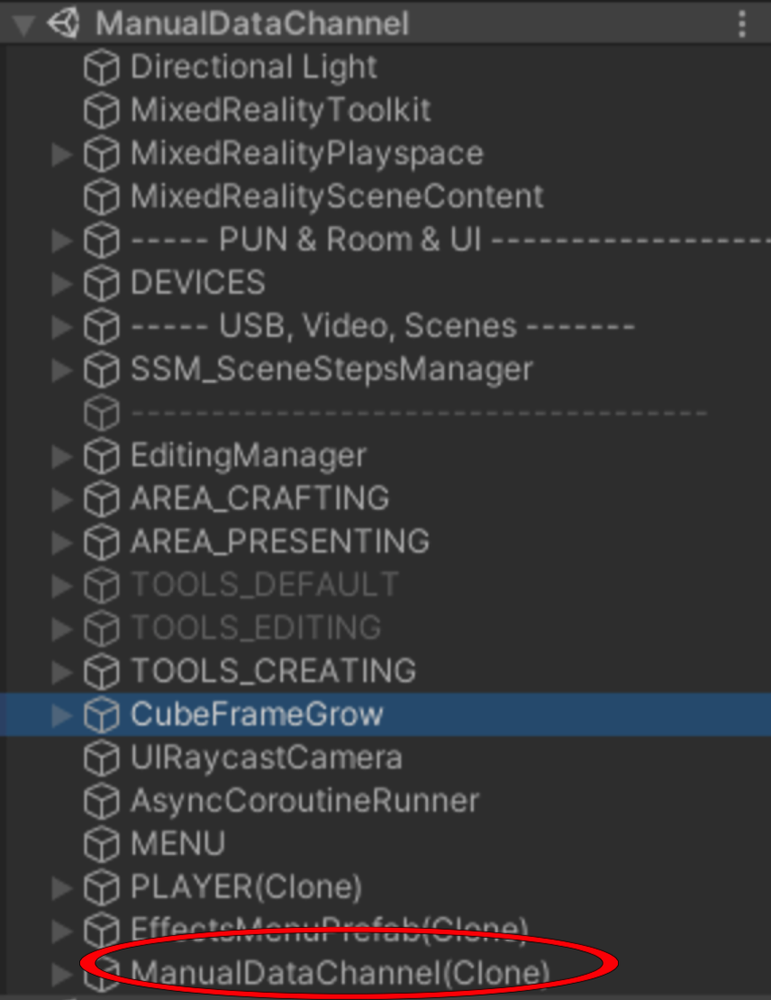
	
</picture>

	CubeFrameGrow  within the scene hierarchy      	          The ManualDataChannel appears in the scene hierarchy after clicking the sensor chart

### **RandomScale Plugin Scene**

<picture>
  
</picture>

In this scene we have a CubeFrame object (named CubeFrameRandomScale) configured to resize randomly according to the RandomScale plugin.

Navigate to the Plugins tab in the EffectsMenu, and click the Launch button next to “Random Scale” to open the GUI (“Graphical User Interface”) for this plugin.

**To activate or deactivate the plugin effect, click the button labeled “On/Off” on the GUI (set to blue for “off” and set to orange for “on”).**
   
**Using the GUI slider, change the amount of random scaling applied to the game object, which is displayed as a float in the top right corner of the menu!**

<picture>
	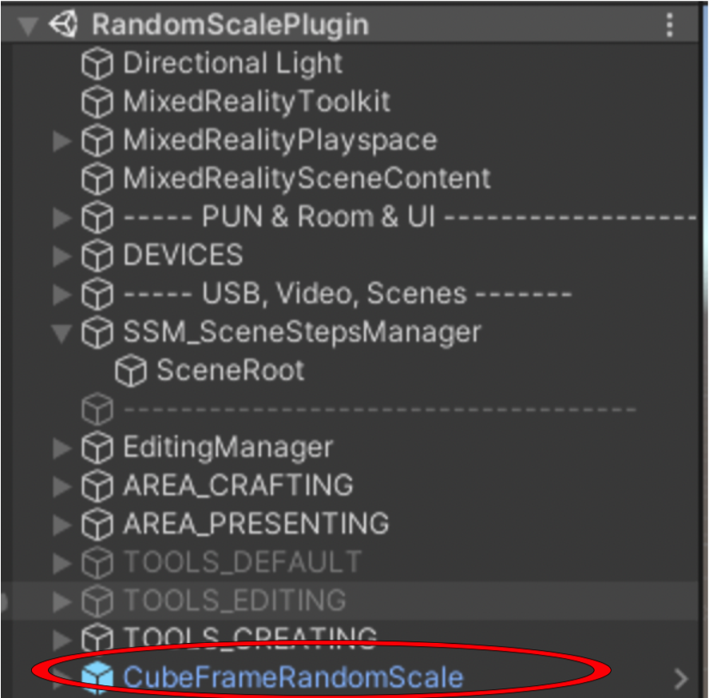
	
</picture>       
<picture>
	
</picture>

	

		

	CubeFrameRandomScale within the scene hierarchy | The RandomScale plugin within the hierarchy of CubeFrameRandomScale

### **Path Plugin Scene**

<picture>
  
</picture>

In this scene we have two arrow objects configured by the path plugin.

Each arrow travels along a path - one named ArrowPathPoints moving along a path between user-defined points (visible roughly in the lower right corner of this gif), and the other named ArrowPathDrawing moving along a path defined by a drawing (moving more erratically around the scene)

Navigate to the Plugins tab in the EffectsMenu, and click the Launch button next to “Path” to open the GUI (“Graphical User Interface”) for this plugin.

**To activate or deactivate the plugin effect, click the button labeled “On/Off” on the GUI!**
   
**To toggle the way the path follows positions, the two options are:**

1. **Click the button labeled “List” to define the path directly as a list of points**
2. **Click the button labeled “Drawing” to define the path as a hand-drawn sequence of points!**

Currently, the list of points has to be defined in the inspector as a list of Vector3s (interpreted as localPositions). The drawing needs to be added as a BaseLineDrawing object.
   
**To toggle the way the object is rotated as it follows the path, the three options are:**

1. **Click the button labeled “None” for no rotation**
2. **Click the button labeled “Forward” for the object to face its direction of movement**
3. **Click the button labeled “List” to define the rotations directly as a list of directions for the object to face!**

Currently, the list of rotations has to be defined in the inspector as a list of Vector3s (interpreted as localRotations)

<picture>
  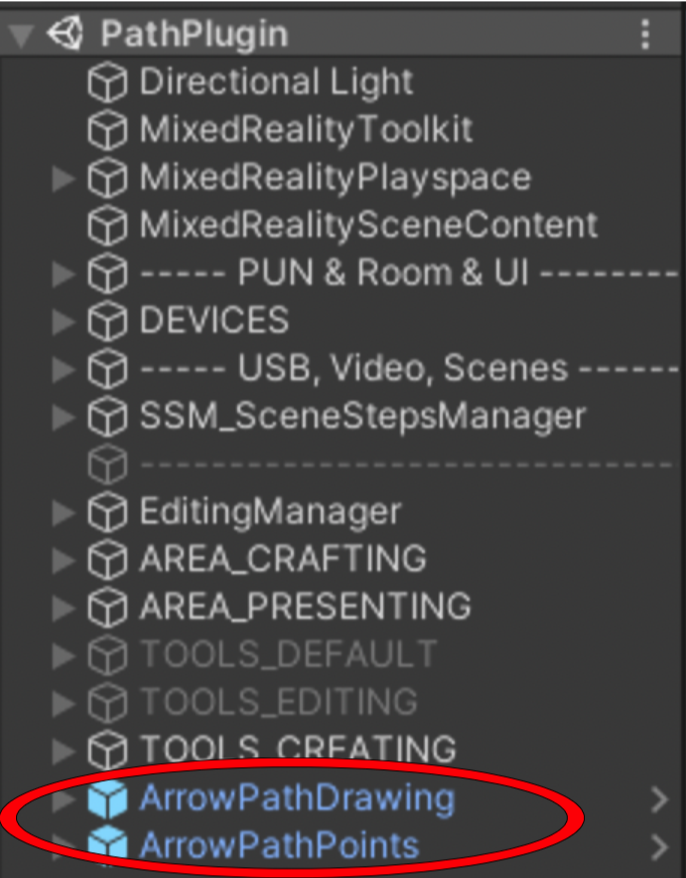
</picture> &nbsp&nbsp&nbsp&nbsp&nbsp&nbsp&nbsp&nbsp&nbsp&nbsp&nbsp&nbsp&nbsp&nbsp&nbsp&nbsp&nbsp&nbsp&nbsp&nbsp&nbsp&nbsp&nbsp&nbsp&nbsp&nbsp&nbsp&nbsp&nbsp&nbsp&nbsp&nbsp&nbsp&nbsp&nbsp&nbsp&nbsp&nbsp&nbsp&nbsp&nbsp&nbsp&nbsp&nbsp&nbsp&nbsp&nbsp&nbsp&nbsp&nbsp&nbsp&nbsp&nbsp&nbsp&nbsp&nbsp&nbsp&nbsp&nbsp&nbsp&nbsp&nbsp&nbsp&nbsp&nbsp&nbsp&nbsp&nbsp&nbsp&nbsp&nbsp&nbsp&nbsp&nbsp&nbsp&nbsp&nbsp&nbsp
	<picture>
	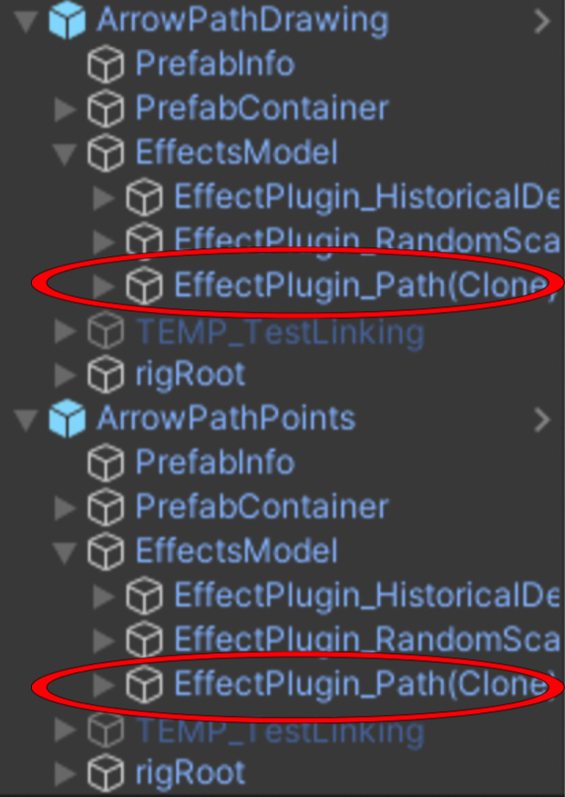
	
</picture>

	ArrowPathPoints and ArrowPathDrawingwithin the scene hierarchy      	    The Path plugin within the hierarchy of ArrowPathPoints and ArrowPathDrawing
