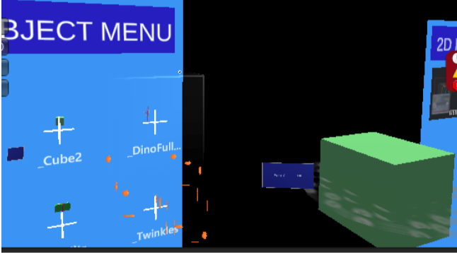

# 3.5. Multiplayer Objects Overview and Tutorial

This documentation accompanies the [Multiplayer Simple Scene](./2.1_Sample_Scenes.md), and describes the types of objects that can occur in a multiplayer project:

* There are 3 types of objects that can be shared in a multiplayer setup; choose the one that your users need.

|                               | What can multiple users do with it?       | What components does it need?                                                       |
| ----------------------------- | ----------------------------------------- | ----------------------------------------------------------------------------------- |
| Object through creation menus | Look, Move, Modify, Spawn multiple copies | Renderer     Collider     PhotonView (ownership: Takeover)                        |
| Static scene object           | Just Look at them                         | None     (If you want basic networking, you can attach PhotonView and script RPCs) |
| Synchronized scene object     | Look, Move, Modify                        | Renderer (somewhere in the object)   PlayerCreatedObject (set: DontMoveToScene)    PhotonView (ownership: Takeover)    PhotonTransformView (sync: all)    Collider (optional; if you want to manually specify boundaries)
 |

* **Objects created through creation menus:** These objects are created at runtime through the object creation menus. Use this if you need users to spawn multiple objects and modify/move them around. They are just like synchronized scene objects but they are created through the menus. 
  * **How to spawn one while running:** To create one, run the project and select a Cube from the in-world creation menu; it will be spawned for all users, and located under the networked objects root object.
    * <picture></picture>
  * **How to add a custom object into the menu before building the scene:**
    * Create a custom prefab for your object
    * Make sure it has a Collider (that’s how users will grab it) and also a PhotonView (that’s how Photon will spawn it; and set its ownership to type Takeover). No other scripts are needed, the system will add other scripts when the object gets spawned.
    * Put the prefab inside the Resources/CreationPrefabs folder. (This folder will be scanned when users see the menu).
    * * Note, whenever you add a new object, you’ll need to rebuild the project for all users, otherwise the users will not have the object.  

* **Static scene objects:** These are built with the scene and are not modifiable by users. Use this if you want all users to just look at the same objects. They are visible to all users, but cannot be moved/modified at runtime. These are just objects which don't really have any special scripts. If you want to understand them more, look at the objects in the example scene.

* **Synchronized scene objects**: These objects are built with the scene, and are modifiable by users. Use this method if you want all users to look and manipulate objects. They are visible to all users and their transform properties (position,rotation,scale) are synchronized between all users. If you want to understand them more, look at the objects in the example scene.