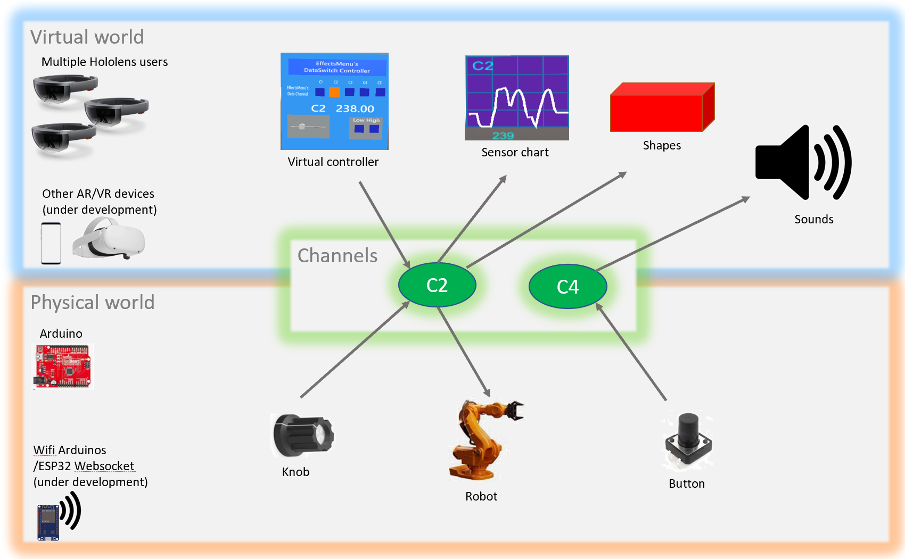
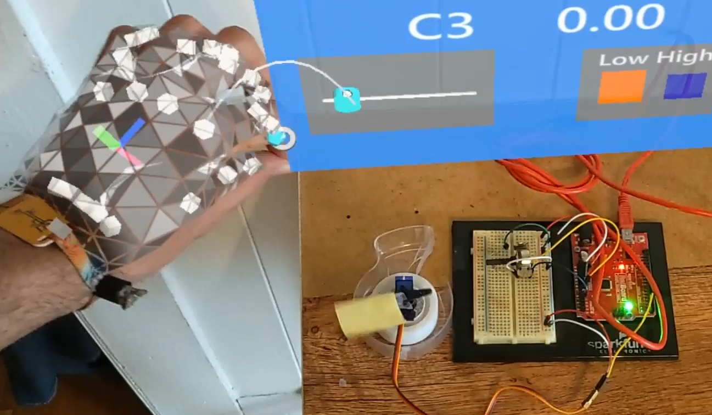
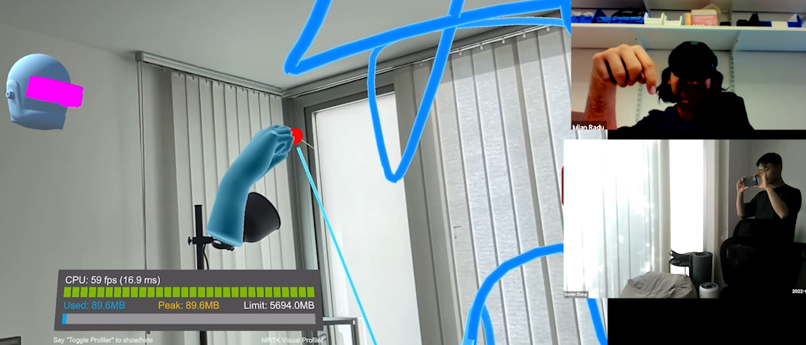
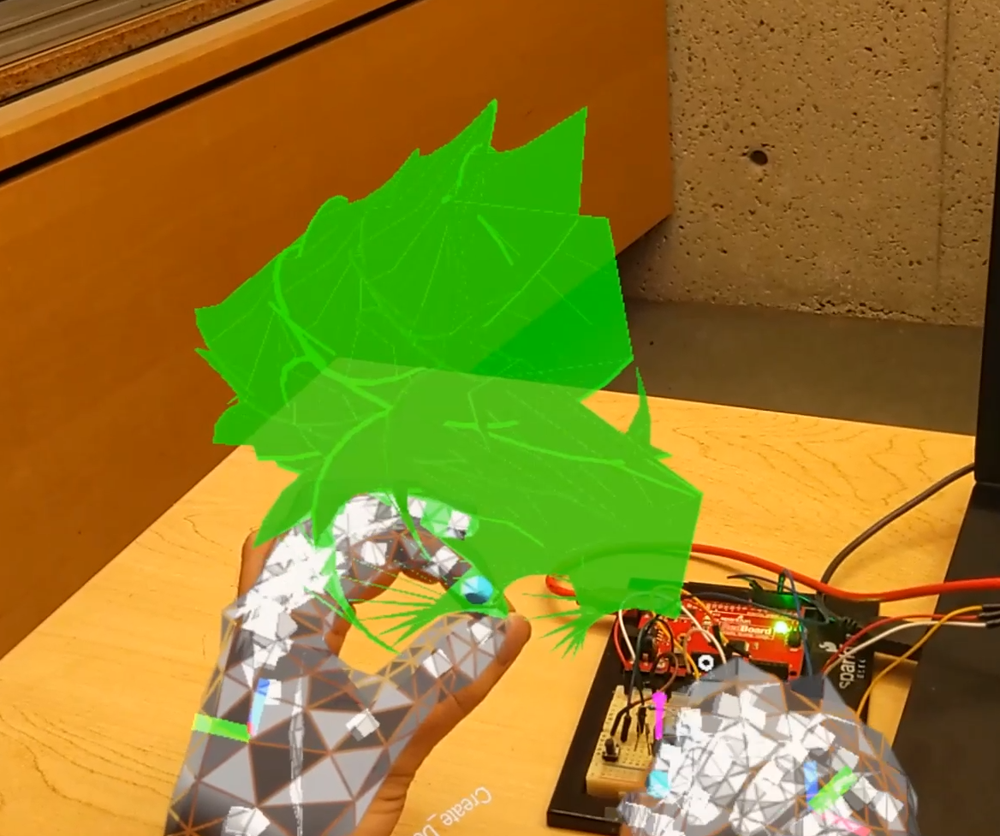
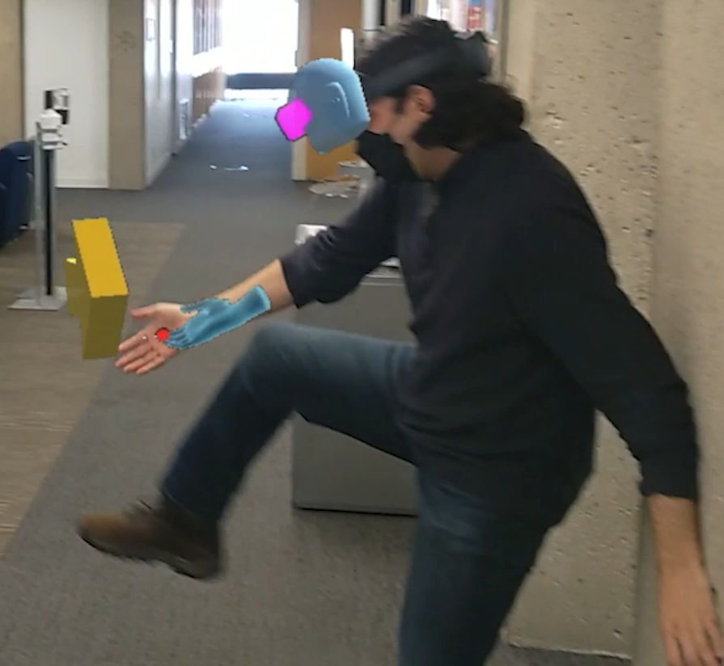

# Latest Branch Of This Repository

The most up to date version of this repository is found at:

[[https://github.com/iuli4n/AR-CYBS-UnityArduinoMultiplayerXR](https://github.com/iuli4n/AR-CYBS-UnityArduinoMultiplayerXR)]

# Screenshots

^ The software connects the virtual world (AR/VR) and physical worlds (Arduino) through data channels.

^ Using a virtual slider (top) to control a physical robot (bottom) [[Video](https://www.instagram.com/p/CiautRyu-fq/)]

^ A smartphone user seeing the virtual shapes drawn by the Hololens user [[Video](https://www.instagram.com/p/CiBRxaaAULz/) 2nd half].

 

^ Left: A physical knob controlling a virtual shape (green) & sound [[Video](https://www.instagram.com/p/CjEj22uL-f9/)]. Right: Kicking around a virtual element [[Video](https://www.instagram.com/p/CiBRxaaAULz/)].

# Features

- **Connect Unity3D to Arduino electronics**
  
  - Arduino to Unity: Use physical sensors to control Unity objects / effects
  
  - Unity to Arduino: Use Unity virtual objects to control physical actuators / robots

- **Connect multiple AR / VR devices together**
  
  - Currently you can connect multiple Hololens devices together and a PC.
  
  - All users can see the shared 3D objects and manipulate them.
  
  - (Under development) You can port this to other MRTK-compatible devices, like smartphones and Oculus / VR headsets.

- **Features for creating 3D worlds:** Use the library menus to create new objects (3D models from the Objects library; 2D images from the Images library). Move/scale/edit objects between multiple users. Add object effects tied to sensor data. (Coming soon: Load OBJ models and images from a web address)

- **Features for connecting sensors to virtual objects**: Sensor values can influence custom effects (ex: generate sounds based on sensors). Sensor values can influence transformations (ex: objects change their scale, rotation, color based on sensor values)

- **Features for creating presentations:** Save/load scenes you've created, and create step-by-step presentations. Virtual laser pointers and drawings for annotating the scenes.

- Summary of features: see [features list](/Documentation/1.2_AR_CYB_Software_Features.md) 

# Licenses

* This project contains multiple software libraries, described in [LICENSE.md](LICENSE.md) file. The Harvard CYBS project is licensed under the 3-Clause BSD License. The external libraries are licensed under their respective licenses, and any use of third party code included in this software or third party libraries linked the software is subject to the third party licenses pertaining to such third party code.

# Downloading and Using

* First please ensure you are looking at the latest repository. The latest repository is found at: [[https://github.com/iuli4n/AR-CYBS-UnityArduinoMultiplayerXR](https://github.com/iuli4n/AR-CYBS-UnityArduinoMultiplayerXR)]

* Hardware requirements: This project will run on a computer without any other devices, but it's meant to do multiplayer AR/VR with Arduino connections. You don't actually need an Arduino or Hololenses; but it's intended to be run on Windows PC (in Unity Editor, or built for Standalone or UWP) with a connected Arduino, and on multiple Hololens 2 (UWP) devices. (Optional: It has been used on iOS Unity; and on Android mobile and on iOS mobile, in multiplayer mode together with a Windows PC and Hololens users; it can probably be ported on other devices compatible with MRTK)

* Installation: Follow [the documentation](/Documentation/1.1_AR_CYB_Software_Information_and_Installation.md) for instructions on downloading and using.

# Features Under Development

* Websocket connections to other wifi electronics (ex: ESP32)

* Deployment on other platforms: Android, Oculus VR

# Known Bugs

* Clicking with the right hand doesn't work well unless the wrist is angled. Use left hand instead.

* Moving/closing the in-world menus needs to be synchronized across all users

* Collider for drawings has some issues

* Effects set on objects do not transfer if those objects are saved/loaded across scenes

